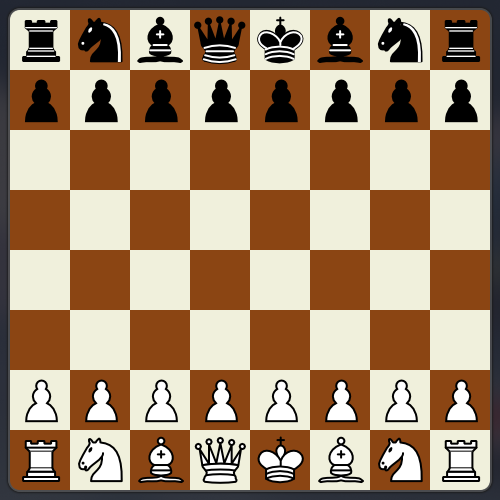

# Chess Project

## Overview
A chess game implementation in C++ with board management, move validation, game logic, and SDL2-based graphics.



## Dependencies
- C++ compiler (supporting C++14)
- CMake 3.5+
- SDL2 library
- SDL2_image library

## Installation
1. Clone the repository:
   ```bash
   git clone <repository-url>
   cd Chess
   ```

2. Install dependencies:
   - On Arch: `sudo pacman -S sdl2-compat sdl2-image cmake`
   - On Ubuntu/Debian: `sudo apt-get install libsdl2-dev libsdl2-image-dev cmake build-essential`
   - On macOS: `brew install sdl2 sdl2_image cmake`
   - On other systems, install `SDL2` and `SDL2_image` via your package manager.

## Building
Run the build script:
```bash
./build.sh
```
This will create a `build/` directory, configure with CMake, and compile the project.

## Usage
Run the chess game:
```bash
./run.sh
```
Or manually:
```bash
cd build
./Chess
```

## Features
- Full chess board setup and visualization with SDL2 graphics
- Move validation and piece rules
- Turn-based gameplay
- Game state management

## Project Structure
```
Chess/
├── CMakeLists.txt     # CMake build configuration
├── build.sh           # Build script
├── run.sh             # Run script
├── readme.md          # This file
├── assets/            # Game assets (images, etc.)
├── previews/          # Game preview (images, etc.)
├── build/             # Build directory (generated)
└── src/
    ├── main.cpp       # Entry point
    ├── Game.cpp       # Game logic
    ├── Game.hpp       # Game header
    ├── Piece.cpp      # Chess piece definitions
    ├── Piece.hpp      # Piece header
    ├── Graphics.cpp   # Graphics handling
    ├── Graphics.hpp   # Graphics header
    └── const.hpp      # Constants
```

## How to Play
1. Start the game by running `./run.sh`
2. Players alternate turns
3. Use mouse/keyboard to select and move pieces
4. Win by checkmate

## Contributing
Feel free to submit issues and enhancement requests.
